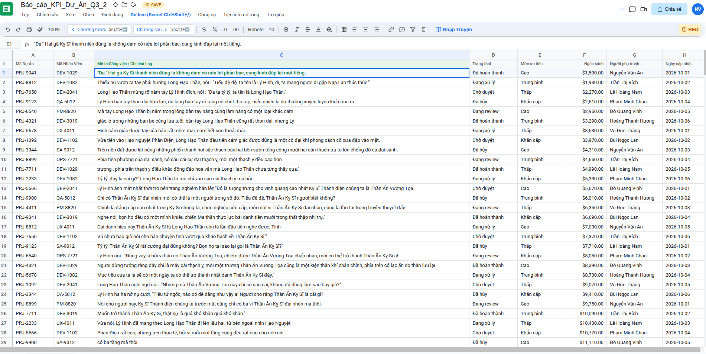
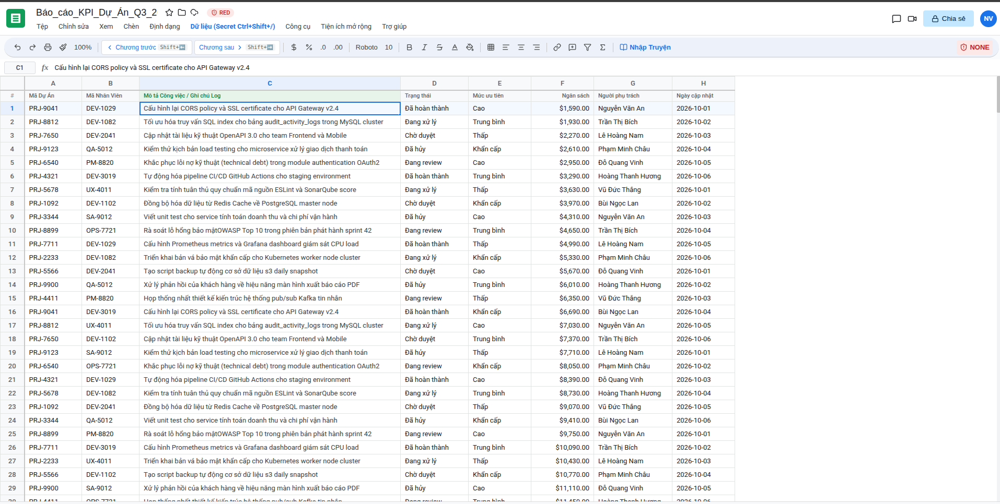
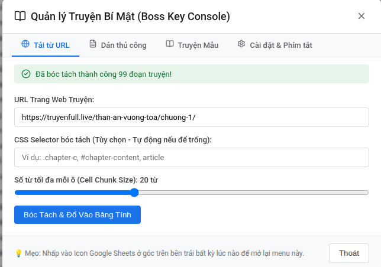

# 📊 Boss Key Sheet - Ứng Dụng Đọc Truyện Ngụy Trang Google Sheets

> **Boss Key Sheet** là ứng dụng web giúp bạn đọc truyện chữ (web novel / ebook) công khai mà không sợ bị phát hiện, bằng cách ngụy trang giao diện đọc truyện thành một bảng tính Google Sheets làm việc chuyên nghiệp 100%.

---

## ✨ Tính Năng Nổi Bật

- 🎨 **Giao diện Google Sheets 1:1**: 
  Thanh công cụ, màu chuẩn Google Green (`#0f9d58`), thanh công thức Formula Bar (`fx`), Sheet Tabs và ô chọn cell sắc nét như thật.
- 🕵️ **Trộn Dữ Liệu Ngụy Trang (Stealth Chunking)**: 
  Cắt văn bản chương truyện thành các đoạn ngắn (15–25 từ) và chèn vào **Cột C (Mô tả công việc / Ghi chú Log)**. Các cột xung quanh hiển thị dữ liệu doanh nghiệp giả lập (Mã dự án `PRJ-9041`, ID nhân viên `DEV-1082`, Trạng thái `Đã hoàn thành`, Ngân sách `$1,450.00`).
- 🚨 **Chế Độ Khẩn Cấp - Panic Mode (`ESC` / `SPACE`)**: 
  Khi sếp hoặc đồng nghiệp đi qua, bấm phím `ESC` hoặc `SPACE` để **lập tức biến toàn bộ nội dung truyện ở Cột C thành log kỹ thuật giả** (*"Cấu hình CORS policy", "Tối ưu SQL index", "Khắc phục lỗi OAuth2"*...) chỉ trong 0.1 giây!
- ⌨️ **Phím Tắt Bí Mật (`Ctrl + Shift + /`)**: 
  Nhấn `Ctrl + Shift + /` hoặc nhấp vào Icon Google Sheets ở góc trên bên trái để mở bảng console bí mật. Hỗ trợ 3 cách tải truyện:
  1. **Tải từ URL**: Tự động bóc tách (crawl) nội dung từ các trang web truyện phổ biến.
  2. **Dán thủ công**: Copy/paste văn bản thô từ bất kỳ đâu.
  3. **Truyện mẫu có sẵn**: Tải nhanh *Tây Du Ký* hoặc *Tam Quốc Diễn Nghĩa*.
- ⬇️ **Đọc Rảnh Tay Bằng Bàn Phím**: 
  Sử dụng phím mũi tên ⬇️ / ⬆️ để di chuyển đọc từng câu. Hệ thống tự động cuộn màn hình mượt mà và đồng bộ câu đang đọc lên thanh **Formula Bar (`fx`)**.
- 💾 **Tự Động Lưu Tiến Độ**: 
  Tự động lưu vị trí dòng đang đọc và nội dung truyện vào `localStorage`, không lo mất dấu khi tải lại trang.

---
 
giao diện đọc truyện


giao diện esc khẩn cấp( có thể sửa lại ở data mẫu)

bản điều khiển
## 🛠️ Hướng Dẫn Cài Đặt & Chạy Dự Án

### Yêu cầu hệ thống
- **Node.js**: Phiên bản 18.x trở lên
- **npm**: Phiên bản 9.x trở lên

### Các bước khởi chạy

#### 1. Clone repository về máy
```bash
git clone https://github.com/sondang2004/excelfake.git
cd excelfake
```

#### 2. Khởi chạy Backend Server (Port 5000)
Mở một cửa sổ Terminal:
```bash
cd backend
npm install
npm run dev
```
> 📍 Backend API sẽ chạy tại: `http://localhost:5000` (Xử lý bóc tách truyện & API crawler).

#### 3. Khởi chạy Frontend React App (Port 5173)
Mở một cửa sổ Terminal thứ hai:
```bash
cd frontend
npm install
npm run dev
```
> 📍 Frontend App sẽ chạy tại: `http://localhost:5173` (Giao diện bảng tính ngụy trang).

#### 4. Trải nghiệm ứng dụng
Mở trình duyệt bất kỳ và truy cập địa chỉ: **`http://localhost:5173`**

---

## ⌨️ Bảng Phím Tắt Sinh Tồn

| Phím Tắt | Hành Động |
| --- | --- |
| **`Ctrl + Shift + /`** *(hoặc `Cmd + Shift + /`)* | Mở / Đóng Bảng điều khiển quản lý truyện bí mật |
| **`ESC`** hoặc **`SPACE`** | Kích hoạt / Tắt tức thì **Panic Mode** (Tráo truyện thành log giả) |
| **`Shift + ➡️ (ArrowRight)`** | **Nhảy sang chương kế tiếp (Next Chapter)** |
| **`Shift + ⬅️ (ArrowLeft)`** | **Lùi về chương trước đó (Prev Chapter)** |
| **`⬇️ (Phím mũi tên xuống)`** | Nhảy xuống đọc câu tiếp theo (Auto-scroll & Sync Formula Bar) |
| **`⬆️ (Phím mũi tên lên)`** | Nhảy lên đọc câu trước đó |
| **`PageDown` / `PageUp`** | Cuộn nhanh 8 dòng truyện |
| **`Home`** | Trở về dòng đầu tiên |


---

## 📁 Cấu Trúc Thư Mục Dự Án

```
excelfake/
├── backend/                  # Server Node.js + Express
│   ├── index.js              # Cheerio Crawler, Text Chunking Engine & API Endpoints
│   └── package.json
├── frontend/                 # Client React + Vite
│   ├── src/
│   │   ├── components/
│   │   │   ├── TopBar.jsx         # Google Sheets Title, Menu Bar & Panic Badge
│   │   │   ├── Toolbar.jsx        # Formatting Tools & Emergency Action Buttons
│   │   │   ├── FormulaBar.jsx     # Active Cell Address & Sync Reading Line (fx)
│   │   │   ├── SpreadsheetGrid.jsx# Table Grid, Column C Story Reader & Keyboard Focus
│   │   │   ├── SecretModal.jsx    # Secret Console (Ctrl+Shift+/) URL Crawler & Paste
│   │   │   └── StatusBar.jsx      # Sheet Tabs & Summary Statistics
│   │   ├── mockData.js        # Generator dữ liệu doanh nghiệp giả lập
│   │   ├── App.jsx            # State Manager, Shortcuts Listener & Persistence
│   │   ├── index.css          # Visual Styling chuẩn Google Sheets
│   │   └── main.jsx
│   ├── index.html
│   └── package.json
└── README.md
```

---

## 🛡️ Giấy Phép & Tuyên Bố Miễn Trừ Trách Nhiệm

Dự án này được tạo ra nhằm mục đích học tập, giải trí và thử nghiệm các kỹ thuật xây dựng giao diện người dùng (UI/UX) độc đáo. Hãy đảm bảo công việc cá nhân vẫn hoàn thành đúng tiến độ! 😉
